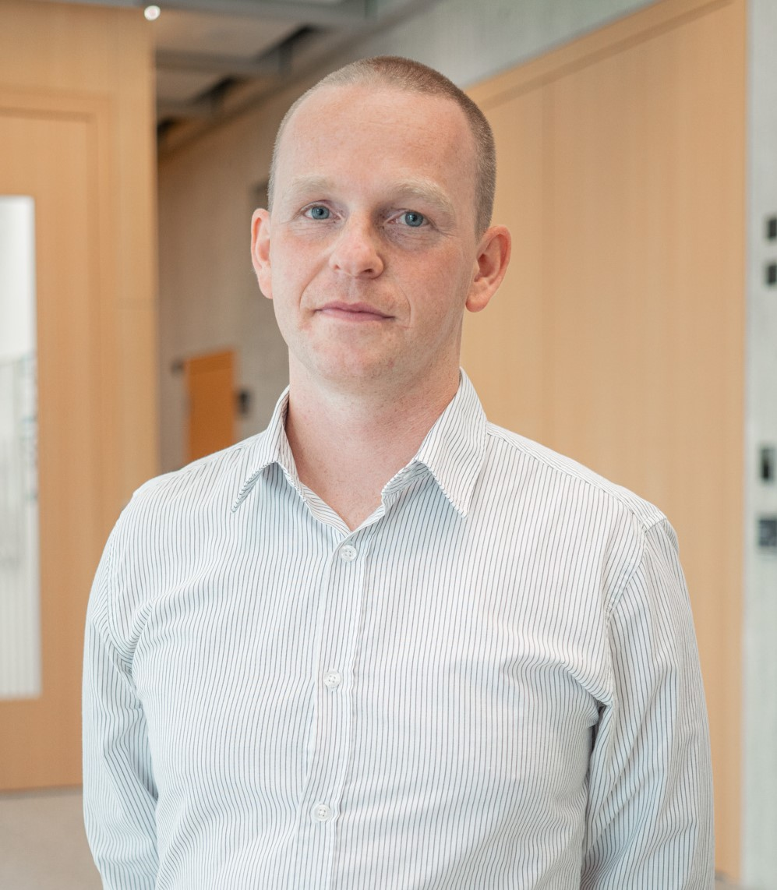

### Personal Information ###

| **Name**               | Michal Bechny
| **Based in**           | Zürich, Switzerland (work permit B)
| **Nationality**        | Czech
|                        | 
| |

### Work Experience ###

| 11/2025 - now    |**Postdoctoral researcher**, *ETH, Zürich*
| | Applied machine learning focusing on the detection of driving impairment and digital biomarkers of drug intoxication
| | [Chair of Information Management](https://im.ethz.ch/) (D-MTEC) \| [Centre for Digital Health Interventions](https://www.c4dhi.org/)
| | 
| 04/2023 - now    | **Data Science consultant** (part-time, remote), *Freelance*
| | Consulting for academic, industrial, and life-science clients
| | **Farmtec a.s.** (dairy industry): leading AI development on lactation-curve modelling, and estrus/calving detection using wearable neck sensors ([vitalimeters](https://www.farmtec.cz/))
| | 
| 09/2021 - 09/2025    |**Doctoral researcher**, *Biomedical Signal Processing group, MeDiTech, SUPSI (Lugano, Switzerland)*
| | Applied research in the sleep medicine field
| | **AI validation**: developing techniques for validation and clinical integration of AI-driven predictive tools
| | **Digital biomarkers**: quantifying novel digital biomarkers for sleep, fatigue, and cardiovascular diseases
| | In collaboration with University Hospital of Bern ([Inselspital](https://www.insel.ch/)) \| Institute of Digital Technologies for Personalised Healthcare ([SUPSI-MeDiTech](https://www.supsi.ch/en/meditech))
| | 
| 10/2024 - 11/2024    |**Visiting researcher**, *The University of Tokyo, Japan*
| | Doctoral research focused on quantifying and interpreting novel markers of sleep-stage dynamics for fatigue and pain clinical conditions
| | Graduate School of Medicine \| [Department of Systems Pharmacology](https://www.m.u-tokyo.ac.jp/)
| | 
| 02/2019 - 09/2021    |**Researcher and Data Scientist**, *Software Competence Center Hagenberg ([SCCH](https://www.scch.at/)), Hagenberg im Mühlkreis, Austria*
| | Applied research in collaboration with steel-manufacturing ([voestalpine](https://www.voestalpine.com/)) and injection-moulding ([starlim-sterner](https://www.starlim-sterner.com/)) industries
| | Real-time outlier detection, forecasting, and missing-data patterns in production data streams
| |

### Education ###

| **University**         | 

| 09/2021 - 10/2025             | PhD. in **Computer Science**, University of Bern, Switzerland
|                        |thesis: *[From Automated Scoring to Digital Biomarkers: Computational Methods Towards Precision Sleep Medicine](https://boristheses.unibe.ch/)*
| | supervised by [Prof. Dr. Athina Tzovara](https://neuro.inf.unibe.ch/menu/atzovara.html) (UniBE)
|                        |
| 10/2024 - 11/2024      | **Visiting**, Graduate School of Medicine, The University of Tokyo, Japan
| | topic: *Quantifying and interpreting novel markers of sleep-stage dynamics for fatigue and pain clinical conditions*
|                        |
| 09/2017 - 04/2020             | MSc. in **Statistics** with focus of Data Science, Institute of Applied Statistics, Johannes Kepler University, Linz, Austria
|                        |thesis *Biclustering for detection of industrial-specific missing data patterns* 
| | supervised by [Assoz. Univ.-Prof.in Mag.a Dr.in Helga Wagner](https://www.jku.at/institut-fuer-angewandte-statistik/ueber-uns/team/assoz-univ-profin-maga-drin-helga-wagner/)
| |
| 09/2015 - 06/2017              | Bc. in **Mathematics-Economics** specialised in Banking/Insurance, Palacký University Olomouc, Czech republic
|                        |thesis *Reliability and validity – different concepts of quality in psychological tests* 
| | supervised by RNDr. PhDr. Ivo Müller, PhD.
| | 

### Skills ###

|**Software**  | R, Python, Shiny Apps, Git, Linux, LaTeX, MS Office, SQL, Mathematica, Statistica, MATLAB

|**Technical**   | Probabilistic Modelling, Machine & Deep Learning, XAI, Causal Inference, Biostatistics, Digital Biomarkers, Decision Support Systems & Validation, Outlier Detection, Forecasting, Process Monitoring

|**Soft**   | Data Storytelling, Scientific Communication, Interdisciplinary Collaboration, Grant & Proposal Writing, Project Management, Economics, Healthcare, Ethics & Regulatory Compliance, Mentorship

|**Other**   | Driving licence (B)

|   |

### Language Skills

|**Czech/Slovak**    |native

|**English**   |professional

|**German**   |conversational

|**Italian**    |basic

|   |

### Activities & Interests

|   | Science, Society, Outdoor, Investing
|   | Cooking: *Making really good apple strudel :)*
|   | Worked summer jobs in England, Austria, Germany, Iceland, and Switzerland
|   | Hitchhiked across Europe
|   | Told after the injury, I won't manage long-distance walking; did a 360 km trek in 10 days with an 18 kg backpack right after

|   |
